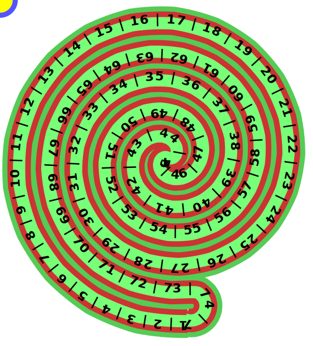

Holistic Management of Planned
Intensive Grassing, involves
moving livestock daily.

To save farmers time while 
moving Cows and Chickens,
I've designed a farming layout 
called "The MultiSpiral Loop"

The MultiSpiral Loop consists
of pairs of spiral paddocks.
The first half of each pair,
spiral inward to centre,
the second half of each pair,
spirals outward from centre.

The beginnings of each half,
loop together such that each
pair of spirals forms an 
endless looping paddock.

The effective length of the
MultiSpiral Loop paddock,
provides up to 100 days of
rested grass by the time 
the cows complete the loop.

   Spiral paddock layout.

The gap spirals could consist
of bamboo forest which would
form hedgerows as a fence and
habitat for birds and animals,
there is a road each side of
forrest (Brown) for vehicles.

</pre>
